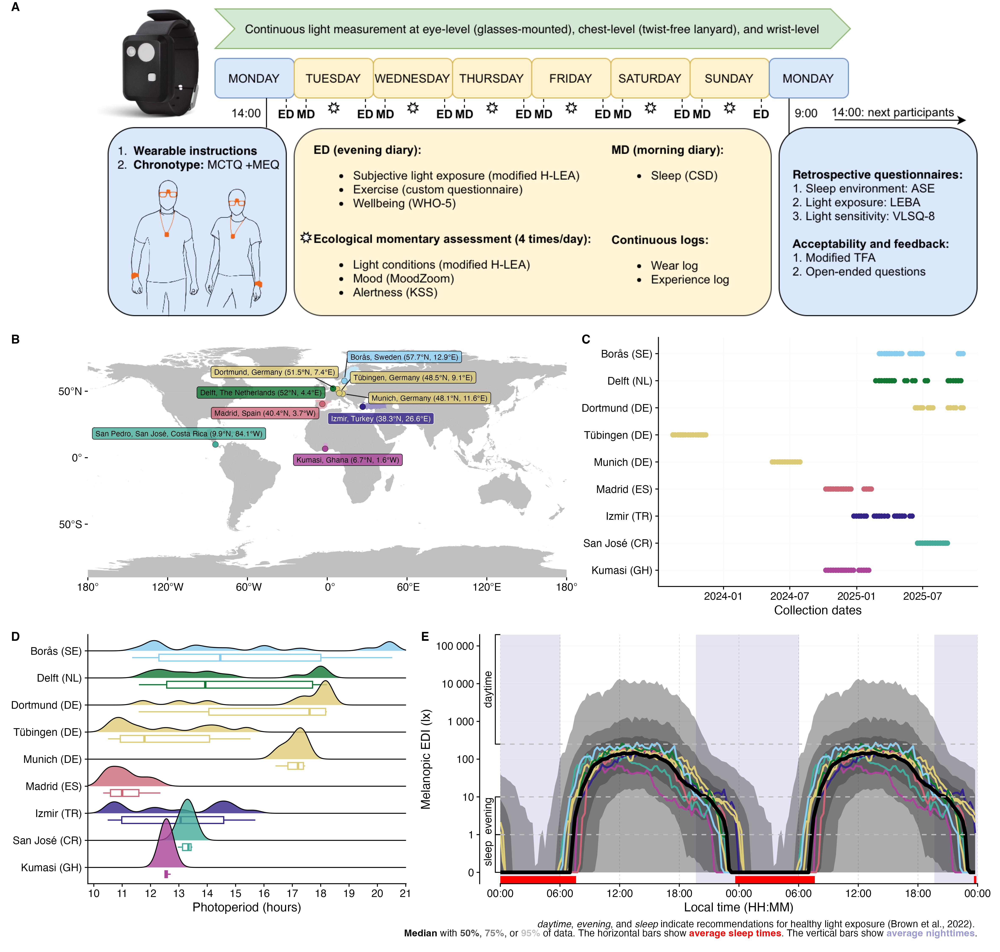

## Preface

:::{.callout-note}

### About this document

This document is part of a seminar on *Open science and FAIR data practices for personal light exposure research* and demonstrates the value and necessity of open science practices to understand scientific results and increase value of collected data beyond its initial use.

:::

Personal light exposure (PLE) varies strongly between geographic locations, photoperiod, climate, the built environment, culture, and especially dependent on human behaviour. This is important, as PLE is increasingly indicated in not just acute effects, like alertness, mood, and wellbeing, but also longterm mental, metabolic, and cardiovascular health. To support longterm health, recommendations for healthy daytime, evening, and nighttime light have been developed, based on laboratory studies on the so-called non-visual effects of light throughout this century[^1].

[^1]: [Brown et al. (2025)](https://journals.plos.org/plosbiology/article?id=10.1371/journal.pbio.3001571)

Wearable light loogers are used to assess personal light exposure under naturalistic conditions. However, our understanding of PLE is dominated from western, industrialized, high-income countries, and especially limited to how PLE varies in different climates. The [MeLiDos project](https://github.com/MeLiDosProject) captured annotated, high-resolution and multi-country datasets with a harmonized protocol in Sweden, the Netherlands, Germany, Spain, Turkey, Costa Rica, and Ghana (@fig-melidos).

{#fig-melidos}

This document uses the [melidosData](https://melidosproject.github.io/melidosData/) R package to load and analyze MeLiDos study data for the `Costa Rica` site. The document has the following goals:

- load wearable data for `Costa Rica`
- load sleep-wake data for the same dataset
- merge sleep-wake data with PLE data
- calculate, summarize, and visualize adherence to recommendations for PLE

The analysis uses standardized processing pipelines through the [LightLogR](https://tscnlab.github.io/LightLogR/) package.
`LightLogR` is designed to facilitate the principled import, processing, and visualization of such wearable‑derived data. Full documentation of `LightLogR`’s features is available on the [documentation page](https://tscnlab.github.io/LightLogR/), including numerous tutorials.

This document assumes general familiarity with the R statistical software, ideally in a data‑science context[^2].

[^2]: If you are new to the R language or want a great introduction to R for data science, we can recommend the free online book [R for Data Science (second edition)](https://r4ds.hadley.nz) by Hadley Wickham, Mine Cetinkaya-Rundel, and Garrett Grolemund.

## How this page works

This document contains the script for the online course series as a [Quarto](https://quarto.org) script, which can be executed on a local installation of R. Please ensure that all libraries are installed prior to running the script:

```{r}
#| eval: false
renv::restore()
```

## Installation

`melidosData` is hosted on [CRAN](https://cran.r-project.org/package=melidosData), which means it can easily be installed from any R console through the following command:

```{r}
#| eval: false
install.packages("melidosData")
```

After installation, it becomes available for the current session by loading the package. We also require a number of packages. Most are automatically downloaded with `LightLogR`, but need to be loaded separately. Some might have to be installed separately on your local machine.

```{r}
#| output: false
library(melidosData) #load the package
library(LightLogR) #load the package
library(tidyverse) #a package for tidy data science
library(gt) #a package for great tables
#the following packages are needed for preview functions:
library(svglite)
library(xml2)
library(downlit)
```

We start by making a decision on the site we want to look at and collect some metadata about it.

```{r}
params$site
params$dataset
site <- params$site
dataset <- paste0("light_", params$dataset, "_1minute")
melidos_coordinates[[site]]
melidos_colors[[site]]
melidos_cities[[site]]
melidos_countries[[site]]
melidos_tzs[[site]]
```

Want to use a different site? Just switch the Institution name in the code cell above

| Institution (site Abbr.) | City | Country | Repository | DOI |
|----------|----------|-------------|--------------------------|---------------------|
| `KNUST` | Kumasi | Ghana | [AkuffoEtAl_Dataset_2025](https://github.com/MeLiDosProject/AkuffoEtAl_Dataset_2025) | 10.5281/zenodo.15576731 |
| `UCR` | San José | Costa Rica | [Sancho-SalasEtAl_Dataset_2025](https://github.com/MeLiDosProject/Sancho-SalasEtAl_Dataset_2025) | 10.5281/zenodo.17289456 |
| `IZTECH` | Izmir | Turkey | [DidikogluEtAl_Dataset_2025](https://github.com/MeLiDosProject/DidikogluEtAl_Dataset_2025) | 10.5281/zenodo.16568109 |
| `FUSPCEU` | Madrid | Spain | [BaezaEtAl_Dataset_2025](https://github.com/MeLiDosProject/BaezaEtAl_Dataset_2025) | 10.5281/zenodo.16834951 |
| `TUM` | Munich | Germany | [HildenEtAl_Dataset_2025](https://github.com/MeLiDosProject/HildenEtAl_Dataset_2025) | 10.5281/zenodo.16893901 |
| `MPI` | Tübingen | Germany | [GuidolinEtAl_Dataset_2025](https://github.com/MeLiDosProject/GuidolinEtAl_Dataset_2025) | 10.5281/zenodo.16895188 |
| `BAUA` | Dortmund | Germany | [BroszioEtAl_Dataset_2025](https://github.com/MeLiDosProject/BroszioEtAl_Dataset_2025) | 10.5281/zenodo.18111232 |
| `THUAS` | Delft | The Netherlands | [AertsEtAl_Dataset_2025](https://github.com/MeLiDosProject/AertsEtAl_Dataset_2025) | 10.5281/zenodo.17979893 |
| `RISE` | Borås | Sweden | [NilssonTengelinEtAl_Dataset_2026](https://github.com/MeLiDosProject/NilssonTengelinEtAl_Dataset_2026) | 10.5281/zenodo.18925834 |

: Overview of the available sites in the package

## Load `r params$dataset`-level light exposure data for `r melidos_countries[[site]]`

The `load_data()` function loads pre-processed data from the *MeLiDos* project. The `site` argument can be set to one or multiple sites. In our case, `r site` loads the right data. Check above to see details about the site. To reduce data complexity, we use 1-minute aggregated data, which has also been pre-processed and cleaned. 

```{r}
data <- load_data(dataset, site = site)
names(data)
#if no internet connection is available:
# load("data/light_chest_1minute.RData")
# data <- light_chest_1min
```

## Load and merge sleep-wake data with light exposure data

We start by loading `sleepdiaries` data. Because we only want to check for data when devices were worn, we also load the `wearlog` information.

```{r}
sleepdata <- load_data("sleepdiaries", site = site)
wearlog <- load_data("wearlog", site = site)
#if no internet connection is available:
# load("data/sleepdiaries.RData")
# sleepdata <- sleepdiary
# load("data/wearlog.RData")
```

In the next step, we prepare the sleepdiary data by selecting a subset containing the participant `ID`, as well as the time when participants prepared to sleep (`sleepprep`) and when the woke (`wake`). Because we are not only interested in labelling sleep periods, but also the in-between wake periods, we pivot the data to a longer form and transform them to intervals. Based on those sleep and wake intervals, we assign states according to Brown et al. (day, evening, night).

```{r}
sleepdata <- 
sleepdata |>
  select(Id, sleep = sleepprep, wake) |> #subset of the sleepdiaries
  group_by(Id) |> #group by participant
  pivot_longer(-Id, names_to = "sleep", values_to = "Datetime") |> #reshape to one row per state
  sc2interval(Statechange.colname = sleep, starting.state = "wake") |> #intervals (with max length) instead of timestamps
  sleep_int2Brown(sleep.state = "sleep", Brown.day = "wake", #Brown et al. intervals
                  Brown.evening = "pre-sleep", Brown.night = "sleep") |> #Brown et al. intervals
  mutate(sleep = case_when(is.na(sleep) & State.Brown == "pre-sleep" ~ "wake", #fill in values for pre-sleep
                                 .default = sleep))
head(sleepdata)
```

The transformed sleep data, as well as photoperiod information and wear states get added to the light exposure data.

```{r}
data <- 
data |> 
  select(Id, Datetime, MEDI) |> #subset of light data
  add_photoperiod(melidos_coordinates[[site]]) |> #add photoperiod information
  add_states(sleepdata, start = Interval, end = Interval) |> #add sleep information
  add_states(wearlog |> select(Id, start, end, wear = state)) #add wear information
names(data)
```

Next, we want to remove instances from the Brown states when the device was not worn during the day or evening.

```{r}
#Remove non-wear data during wake or pre-sleep
data <-
data |> 
  mutate(
    State.Brown = replace_when(
      State.Brown,
      wear == "off" & sleep != "sleep" ~ NA
    )
  )
```

## Adherence to Brown et al. recommendations

The first step is to check whether the melanopic EDI were satisfactory at a given moment through the `Brown2reference()` function.

```{r}
data <- 
data |> 
  Brown2reference(Brown.day = "wake", #check whether melEDI are ok
                  Brown.evening = "pre-sleep",
                  Brown.night = "sleep")
names(data)
```

Based on the previous figure, we can add information on whether a given timepoint was adherent to the recommendations.

Finally, we calculate exact adherance percentages across states...

```{r}
adherence_summary <- 
data |> 
  group_by(State.Brown) |> #group data by Brown state
  durations(Reference.check, #calculate the length for each group
            show.missing = TRUE, #show where data is missing
            FALSE.as.NA = TRUE) |> #regard a FALSE in the data as missing
  ungroup() |> #remove grouping
  mutate(across(duration:missing, \(x) x/total), #calculate percentages
         of.total = (total/sum(total)) |> as.numeric(), #calculate percentages
         duration = replace_values(duration, 0 ~ NA)) |> #set missing
  rename(adherence = duration,
         duration = total) |> #rename
  select(-missing) #remove unneeded column
adherence_summary
```

...and add a summary row

```{r}
adherence_summary <- 
adherence_summary |> 
  drop_na() |> 
  summarize( #calculate summary row:
    State.Brown = "Overall",
    adherence = (adherence*of.total) |> sum(),
    duration = sum(duration) |> as.duration(),
    of.total = sum(of.total),
    adherence = adherence/of.total
  ) |> 
  rbind(adherence_summary) #add the summary row to the detailed table
adherence_summary
```

In the final step, we bring this table into a nice layout.

```{r}
adherence_summary |> 
gt() |> 
  fmt_percent(c(adherence, of.total), decimals = 1) |> #format as percent
  sub_missing(missing_text = "Unkown") |> #rename missing entries
  cols_label_with(fn = \(x) str_replace(x, "\\.", " ") |> str_to_title()) |> #tranform labels
  tab_style( #show some cells bold
    cell_text(weight = "bold"),
    list(cells_column_labels(), cells_body(1))
  ) |> 
  tab_style( #show a highlight for the summary row
    cell_fill("lightgrey"),
    cells_body(rows = 1)
  ) |> 
  fmt_duration(duration, input_units = "seconds", output_units = "weeks") |> #format as duration
  tab_header("Adherence to recommendations for healthy lighting", #add a header
             subtitle = 
               paste0(melidos_cities[[site]], melidos_countries[[site]], sep = ", ")
             )
```

## Session info

```{r}
sessionInfo()
```

